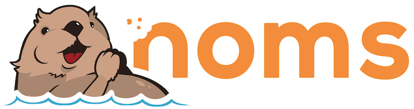

[Command-Line Tour](doc/cli-tour.md)&nbsp; | &nbsp;[Go SDK Tour](doc/go-tour.md)&nbsp; | &nbsp;[Documentation](doc/index.md)&nbsp; | &nbsp;[Project Status](#status)&nbsp; | &nbsp;[Download](https://s3-us-west-2.amazonaws.com/downloadstable.noms.io/index.html?prefix=jobs/NomsBuildGoBinaries-v7/)
<br><br>
[](http://jenkins3.noms.io/job/NomsMasterBuilder/)
[](https://codecov.io/gh/attic-labs/noms)
[](https://godoc.org/github.com/attic-labs/noms)
[](http://slack.noms.io)

*Noms* is a decentralized database philosophically descendant from the Git version control system.

Like Git, Noms is:

* **Versioned:** By default, all previous versions of the database are retained. You can trivially track how the database evolved to its current state, easily and efficiently compare any two versions, or even rewind and branch from any previous version.
* **Synchronizable:** Instances of a single Noms database can be disconnected from each other for any amount of time, then later reconcile their changes efficiently and correctly.

Unlike Git, Noms is a database, so it also:

* Primarily **stores structured data**, not files and directories (see: [the Noms type system](https://github.com/attic-labs/noms/blob/master/doc/intro.md#types))
* **Scales well** to large amounts of data and concurrent clients (TODO: benchmarks)
* Supports **atomic transactions** (a single instance of Noms is CP, but Noms is typically run in production backed by S3, in which case it is "[effectively CA](https://cloud.google.com/spanner/docs/whitepapers/SpannerAndCap.pdf)")
* Supports **efficient indexes** (see: [Noms prolly-trees](https://github.com/attic-labs/noms/blob/master/doc/intro.md#prolly-trees-probabilistic-b-trees))
* Features a **flexible query model** (see: [GraphQL](./go/ngql/README.md))

Finally, because Noms is content-addressed, it yields a very pleasant programming model.

Working with Noms is ***declarative***. You don't `INSERT` new data, `UPDATE` existing data, or `DELETE` old data. You simply *declare* what the data ought to be right now. If you commit the same data twice, it will be deduplicated because of content-addressing. If you commit _almost_ the same data, only the part that is different will be written.

<br>

## Install Noms

Noms is supported on Mac OS X and Linux.

1. [Download the latest build](https://s3-us-west-2.amazonaws.com/downloadstable.noms.io/index.html?prefix=jobs/NomsBuildGoBinaries-v7/)

  The build contains the Noms command-line and some utility tools. You can use `tar -ztvf noms-*.tar.gz` to view the contents of the tar.

2. Extract the Noms commands.

  `tar -xzf noms-*.tar.gz`

<br>

## Get started

1. Use the `noms ds` command to connect to the `cli-tour` database.

    ```
    ./noms ds http://demo.noms.io/cli-tour
    chi-building-violations
    chi-building-violations/backup
    chi-building-violations/raw
    ...<snip>..
    sf-film-locations
    sf-film-locations/raw
    sf-fire-inspections
    sf-fire-inspections/raw
    sf-registered-business
    sf-registered-business/raw
    ```

2. View the history for the `sf-film-locations` dataset.

    ```
    ./noms log http://demo.noms.io/cli-tour::sf-film-locations
    ```

<br>

## Learn Noms

Learn the basics: [Introduction to Noms](doc/intro.md)

Tour the CLI: [Command-Line Interface Tour](doc/cli-tour.md)

Tour the Go API: [Go SDK Tour](doc/go-tour.md)

<br>

## Status / Roadmap

Noms is currently under heavy development. Attic Labs plans to use it as an integral piece of an upcoming consumer product.

### Data Format

We are fairly confident in the core data format, and plan to support Noms database [version `7`](https://github.com/attic-labs/noms/blob/v7/go/constants/version.go#L9) and forward. If you create a database with Noms today, future versions will have migration tools to pull your databases forward.

### Roadmap

We plan to implement the following for Noms version 8. Beyond that unknown.

- [x] Horizontal scalability (Done! See: [nbs](./go/nbs/README.md))
- [x] Automatic merge (Done! See: [CommitOptions.Policy](https://godoc.org/github.com/attic-labs/noms/go/datas#CommitOptions) and the `noms merge` subcommand).
- [ ] Query language (In progress: See [ngql](./go/ngql/README.md))
- [ ] Garbage Collection (https://github.com/attic-labs/noms/issues/3192)
- [x] Optional fields (https://github.com/attic-labs/noms/issues/2327)
- [ ] Fix sync performance with long commit chains (https://github.com/attic-labs/noms/issues/2233)
- [ ] [Various other smaller bugs and improvements](https://github.com/attic-labs/noms/issues?q=is%3Aissue+is%3Aopen+label%3AFormat)

### API

The Public API will continue to evolve. Pull requests which represent breaking API changes should be marked with `APIChange` and sent to the slack channel and mailing list below for advance warning and feedback.

<br>

## Talk

If you'd like to use Noms for something, we'd love to hear. Contact us:

- [Slack](http://slack.noms.io)
- [Mailing List](https://groups.google.com/forum/#!forum/nomsdb)
- [Twitter](https://twitter.com/nomsdb)
