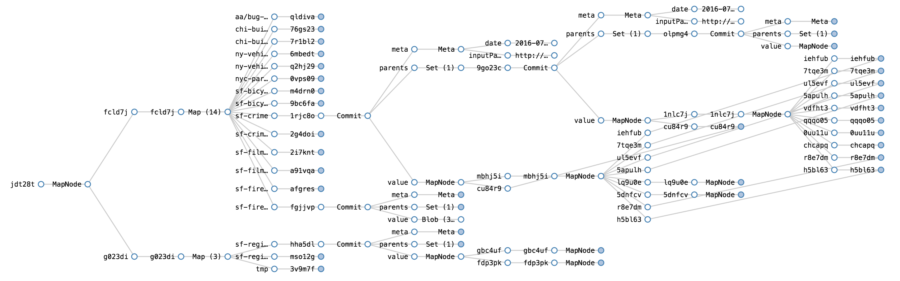
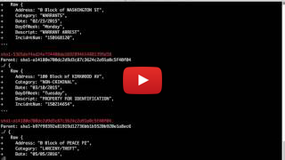
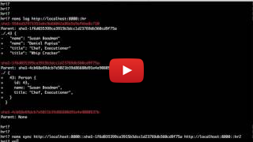

<br>
[Command-Line Tour](doc/cli-tour.md)&nbsp; | &nbsp;[Go SDK Tour](doc/go-tour.md)&nbsp; | &nbsp;[JavaScript SDK Tour](doc/js-tour.md)&nbsp; | &nbsp;[Documentation](doc/index.md)&nbsp; | &nbsp;[Project Status](#status)&nbsp; | &nbsp;[Download](https://s3-us-west-2.amazonaws.com/download.noms.io/index.html?prefix=jobs/NomsBuildGoBinaries/)
<br><br>
[](http://jenkins.noms.io/job/NomsMasterBuilder)
[](https://codecov.io/gh/attic-labs/noms)
[](https://godoc.org/github.com/attic-labs/noms)
[](http://slack.noms.io)

*Noms* is a decentralized database based on ideas from Git.

This repository contains two reference implementations of the database—one in Go, and one in JavaScript. It also includes a number of tools and sample applications.

<br>
 
## About Noms

Noms is different from other databases. It is:

* *Content-addressed*. If you have some data you want to put into Noms, you don't have to worry about whether it already exists. Duplicate data is automatically ignored. There is no update, only insert.

* *Append-only*. When you commit data to Noms, you aren't overwriting anything. Instead you're adding to a historical record. By default, data is never removed from Noms. You can see the entire history of the database, diff any two commits, or rewind to any previous point in time.

* *Typed*. Every value, dataset, and version of a database has a *type*, which is generated automatically as you add data. You can write code against the type of a Noms database, confident that you've handled all the cases you need to.

* *Decentralized*. If I give you a copy of my database, you and I can modify our copies disconnected from each other, and come back together and merge our changes efficiently and correctly days, weeks, or years later.

<br/>
## Setup

Noms is supported on Mac OS X and Linux. You can compile a Windows build from source, and it usually works, but isn't officially supported.

1. [Download the latest Noms build](https://s3-us-west-2.amazonaws.com/download.noms.io/index.html?prefix=jobs/NomsBuildGoBinaries/)
2. Extract it: `tar -xzf noms-*.tar.gz`
2. Run:

```
./noms ds http://demo.noms.io/cli-tour

./noms log http://demo.noms.io/cli-tour::sf-film-locations
```


<br/>
## Explore
<a href="http://splore.noms.io/?db=https://demo.noms.io/cli-tour"><br>Visually explore a demo instance of Noms</a>

<br/>
## What Noms is Good For

#### Data Version Control

Noms gives you the entire Git workflow, but for large-scale structured (or unstructured) data. Fork, merge, track history, efficiently synchronize changes, etc.

[](https://www.youtube.com/watch?v=Zeg9CY3BMes)<br/>
*[`noms diff` and `noms log` on large datasets](https://www.youtube.com/watch?v=Zeg9CY3BMes)*


#### An Application Database with History

A database where every change is automatically and efficiently preserved. Instantly revert to, fork, or work from any historical commit.

[](https://www.youtube.com/watch?v=JDO3z0vHEso)<br/>
*[Versioning, Diffing, and Syncing with Noms](https://www.youtube.com/watch?v=JDO3z0vHEso)*


#### An Archival Database

Trivially import snapshots from any format or API. Data is automatically versioned and deduplicated. Track the history of each datasource. Search across data sources.

*TODO: Sample and video*


<br>
## Status

#### Data Format

We are fairly confident in the core data format, and plan to support Noms database [version `7`](https://github.com/attic-labs/noms/blob/master/go/constants/version.go#L8) and forward. If you create a database with Noms today, future versions will have migration tools to pull your databases forward.


#### Completeness

We're just getting started. Some important features are not yet implemented including a query system, concurrency, auto-merging, and GC.

#### API

The Public API will continue to evolve. Pull requests which represent breaking API changes should be marked with `APIChange` and sent to the slack channel and mailing list below for advance warning and feedback.

<br>
## Talk

- [Slack](http://slack.noms.io)
- [Mailing List](https://groups.google.com/forum/#!forum/nomsdb)
- [Twitter](https://twitter.com/nomsdb)
