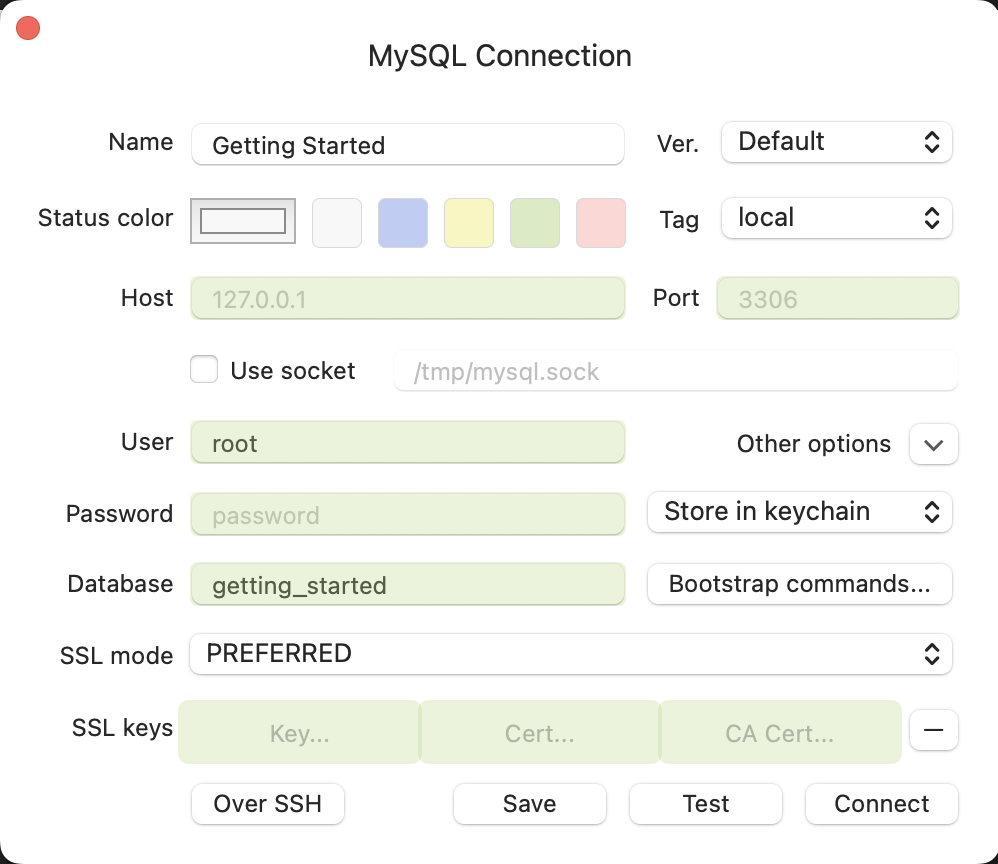
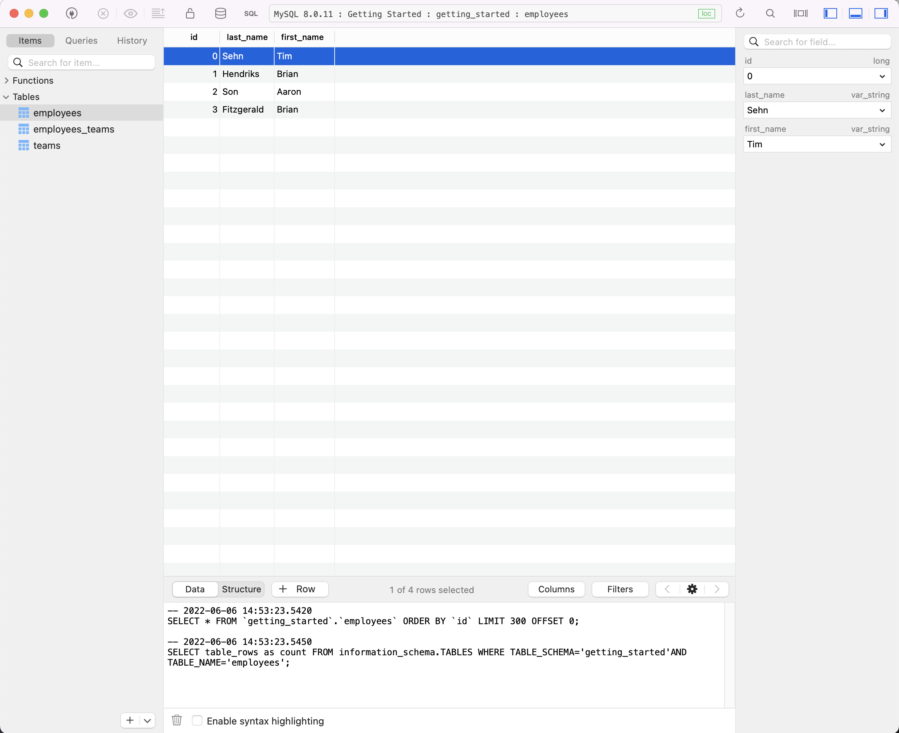
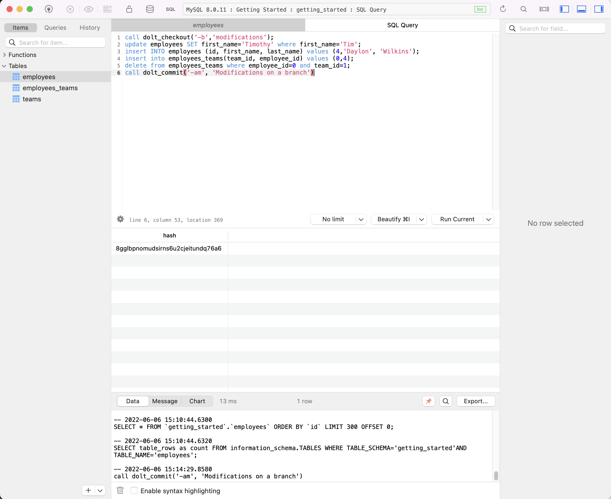

# Dolt is Git for Data!

Dolt is a SQL database that you can fork, clone, branch, merge, push
and pull just like a Git repository. 

Connect to Dolt just like any MySQL database to read or modify schema 
and data. Version control functionality is exposed in SQL via system 
tables, functions, and procedures. 

Or, use the Git-like command line interface to import CSV files, commit 
your changes, push them to a remote, or merge your teammate's changes.
All the commands you know for Git work exactly the same for Dolt. 

Git versions files. Dolt versions tables. It's like Git and MySQL had a
baby.

We also built [DoltHub](https://www.dolthub.com), a place to share
Dolt databases. We host public data for free. If you want to host
your own version of DoltHub, we have [DoltLab](https://www.doltlab.com). 
If you want us to run a Dolt server for you, we have [Hosted Dolt](https://hosted.doltdb.com). 

Prefer Postgres instead of MySQL? Try [Doltgres](https://github.com/dolthub/doltgresql), now
in its Beta release.

[Join us on Discord](https://discord.com/invite/RFwfYpu) to say hi and
ask questions, or [check out our roadmap](https://docs.dolthub.com/other/roadmap) 
to see what we're building next.

# Video Introduction

[](https://www.youtube.com/watch?v=H2iZy0Cme10)

# What's it for?

Lots of things! Dolt is a generally useful tool with countless
applications. But if you want some ideas, [here's how people are using
it so far](https://dolthub.com/blog/2024-10-15-dolt-use-cases/).

Dolt can be [set up as a replica of your existing MySQL](https://www.dolthub.com/blog/2023-02-17-binlog-replication-preview/)
database using standard MySQL binlog replication. Every write becomes
a Dolt commit. This is a great way to get the version control benefits 
of Dolt and keep an existing MySQL database. 

# Dolt CLI

The `dolt` CLI has the same commands as `git`, with some extras.

```
$ dolt
Valid commands for dolt are
                init - Create an empty Dolt data repository.
              status - Show the working tree status.
                 add - Add table changes to the list of staged table changes.
                diff - Diff a table.
               reset - Remove table changes from the list of staged table changes.
               clean - Remove untracked tables from working set.
              commit - Record changes to the repository.
                 sql - Run a SQL query against tables in repository.
          sql-server - Start a MySQL-compatible server.
                 log - Show commit logs.
              branch - Create, list, edit, delete branches.
            checkout - Checkout a branch or overwrite a table from HEAD.
               merge - Merge a branch.
           conflicts - Commands for viewing and resolving merge conflicts.
         cherry-pick - Apply the changes introduced by an existing commit.
              revert - Undo the changes introduced in a commit.
               clone - Clone from a remote data repository.
               fetch - Update the database from a remote data repository.
                pull - Fetch from a dolt remote data repository and merge.
                push - Push to a dolt remote.
              config - Dolt configuration.
              remote - Manage set of tracked repositories.
              backup - Manage a set of server backups.
               login - Login to a dolt remote host.
               creds - Commands for managing credentials.
                  ls - List tables in the working set.
              schema - Commands for showing and importing table schemas.
               table - Commands for copying, renaming, deleting, and exporting tables.
                 tag - Create, list, delete tags.
               blame - Show what revision and author last modified each row of a table.
         constraints - Commands for handling constraints.
             migrate - Executes a database migration to use the latest Dolt data format.
         read-tables - Fetch table(s) at a specific commit into a new dolt repo
                  gc - Cleans up unreferenced data from the repository.
       filter-branch - Edits the commit history using the provided query.
          merge-base - Find the common ancestor of two commits.
             version - Displays the current Dolt cli version.
                dump - Export all tables in the working set into a file.
```

# Installation

Dolt is a single ~103 megabyte program. 

```bash
dolt $ du -h /Users/timsehn/go/bin/dolt
103M	/Users/timsehn/go/bin/dolt
```

It's really easy to install. Download it and put it on your `PATH`. 
We have a bunch of ways to make this even easier for most platforms.

## From Latest Release

To install on Linux or Mac based systems run this command in your
terminal:

```
sudo bash -c 'curl -L https://github.com/dolthub/dolt/releases/latest/download/install.sh | bash'
```

This will download the latest `dolt` release and put it in
`/usr/local/bin/`, which is probably on your `$PATH`.

The install script needs sudo in order to put `dolt` in `/usr/local/bin`. If you don't have root
privileges or aren't comfortable running a script with them, you can download the dolt binary
for your platform from [the latest release](https://github.com/dolthub/dolt/releases), unzip it,
and put the binary somewhere on your `$PATH`.

### Linux

#### Arch Linux

Dolt is packaged in the official repositories for Arch Linux.

```
pacman -S dolt
```

### Mac

#### Homebrew

Dolt is on Homebrew, updated every release.

```
brew install dolt
```
#### MacPorts

On macOS, Dolt can also be installed via a [community-managed port](https://ports.macports.org/port/dolt/) via [MacPorts](https://www.macports.org):

```sh
sudo port install dolt
```

### Windows

Download the latest Microsoft Installer (`.msi` file) in
[releases](https://github.com/dolthub/dolt/releases) and run
it.

For information on running on Windows, see [here](https://docs.dolthub.com/introduction/installation/windows).

#### Chocolatey

You can install `dolt` using [Chocolatey](https://chocolatey.org/):

```sh
choco install dolt
```

#### Docker

There are following official Docker images for Dolt:

* [`dolthub/dolt`](https://hub.docker.com/r/dolthub/dolt) for running Dolt
as CLI tool.
* [`dolthub/dolt-sql-server`](https://hub.docker.com/r/dolthub/dolt-sql-server) for running Dolt in server mode.

## From Source

Make sure you have Go installed, and that `go` is in your path. Dolt has a dependency on [cgo](https://pkg.go.dev/cmd/cgo), so you will need a working C compiler and toolchain as well.

Clone this repository and cd into the `go` directory. Then run:

```
go install ./cmd/dolt
```

The output will be in `$GOPATH/bin`, which defaults to `~/go/bin`. To test your build, try:

```
~/go/bin/dolt version
```

# Configuration

Verify that your installation has succeeded by running `dolt` in your
terminal.

```
$ dolt
Valid commands for dolt are
[...]
```

Configure `dolt` with your user name and email, which you'll need to
create commits. The commands work exactly the same as git.

```
$ dolt config --global --add user.email YOU@DOMAIN.COM
$ dolt config --global --add user.name "YOUR NAME"
```

# Getting started

## Navigate to the directory where you would like your data stored

Dolt needs a place to store your databases. I'm going to put my databases in `~/dolt`. 

```bash
% cd ~
% mkdir dolt
% cd dolt
```

Any databases you create will be stored in this directory. So, for this example, a directory named `getting_started` will be created here once you run `create database getting_started`. Navigating to `~/dolt/getting_started` will allow you to access this database using the Dolt command line.

NOTE: For this example, the `getting_started` directory will be created after you run `create database getting_started;` in a SQL shell in the [Create a schema section](#create-a-schema). Don't do anything except make the directory and navigate to it just yet.

## Start a MySQL-compatible database server

Dolt ships with a MySQL compatible database server built in. To start it you use the command `dolt sql-server`. Running this command starts the server on port 3306. 

```bash
dolt sql-server
Starting server with Config HP="localhost:3306"|T="28800000"|R="false"|L="info"
```

Your terminal will just hang there. This means the server is running. Any errors will be printed in this terminal. Just leave it there and open a new terminal.

## Connect with a MySQL client (up to version 8.4)

In the new terminal, we will now connect to the running database server using a client. Dolt also ships with a MySQL compatible client. 

```bash
% dolt -u root -p "" sql
# Welcome to the Dolt MySQL client.
# Statements must be terminated with ';'.
# "exit" or "quit" (or Ctrl-D) to exit.
mysql>
```

In the other terminal where you ran `dolt sql-server`, you'll see the following log line.

```
2022-06-06T13:14:32-07:00 INFO [conn 1] NewConnection {DisableClientMultiStatements=false}
```

You are connected!

While we're here let's grab a copy of MySQL so we can connect with that client. Head over to the [MySQL Getting Started](https://dev.mysql.com/doc/mysql-getting-started/en/) documentation and install MySQL on your machine. I used [Homebrew](https://brew.sh/) to install MySQL on my Mac: `brew install mysql@8.4`. Alternatively, you can install only the client component by running `brew install mysql-client@8.4`.

NOTE: Make sure you install a MySQL 8.4 release. MySQL 8.4 is the current Long Term Support (LTS) release, meaning this is the stable and supported version of MySQL. MySQL 9.0 is also available, but is an "innovation" release, meaning it has more recent changes and features, but may not be as stable as the LTS release. The 9.0 release changes authentication support and isn't able to connect to a Dolt SQL server by default. You can install MySQL 8.4 with Homebrew by running `brew install mysql@8.4`. If you do want to use MySQL-9.0, read [our post on how to configure Dolt for `caching_sha2_password` authentication](https://www.dolthub.com/blog/2024-12-11-mysql9-and-caching-sha2-auth-support/). 

MySQL comes with a MySQL server called `mysqld` and a MySQL client called `mysql`. You're only interested in the client. After following the instructions from MySQL's documentation, make sure you have a copy of the `mysql` client on your path:

```bash
% mysql --version
mysql  Ver 8.0.29 for macos12.2 on x86_64 (Homebrew)
```

Now, to connect the `mysql` client to Dolt, you are going to force the MySQL client through the TCP interface by passing in a host and port. The default is the socket interface which Dolt supports, but is only available on `localhost`. So, it's better to show off the TCP interface. The MySQL client also requires you specify a user, in this case `root`.

```bash
% mysql --host 127.0.0.1 --port 3306 -uroot
Welcome to the MySQL monitor.  Commands end with ; or \g.
Your MySQL connection id is 2
Server version: 5.7.9-Vitess 

Copyright (c) 2000, 2022, Oracle and/or its affiliates.

Oracle is a registered trademark of Oracle Corporation and/or its
affiliates. Other names may be trademarks of their respective
owners.

Type 'help;' or '\h' for help. Type '\c' to clear the current input statement.

mysql>
```

Again, to ensure the client actually connected, you should see the following in the `dolt sql-server` terminal 

```
2022-06-06T13:26:55-07:00 INFO [conn 2] NewConnection {DisableClientMultiStatements=false}
```

As you can see, Dolt supports any MySQL-compatible client. Dolt ships with a client but you can use any MySQL client, like the one that comes with MySQL.

## Create a schema

Now we're actually ready to do something interesting. I'll stay in the `mysql` client and execute the following SQL statements to create a database called `getting_started`. The `getting_started` database will have three tables: `employees`, `teams`, and `employees_teams`.

```
mysql> create database getting_started;
Query OK, 1 row affected (0.04 sec)

mysql> use getting_started;
Database changed
mysql> create table employees (
    id int, 
    last_name varchar(255), 
    first_name varchar(255), 
    primary key(id));
Query OK, 0 rows affected (0.01 sec)

mysql> create table teams (
    id int, 
    team_name varchar(255), 
    primary key(id)); 
Query OK, 0 rows affected (0.00 sec)

mysql> create table employees_teams(
    team_id int, 
    employee_id int, 
    primary key(team_id, employee_id), 
    foreign key (team_id) references teams(id), 
    foreign key (employee_id) references employees(id));
Query OK, 0 rows affected (0.01 sec)

mysql> show tables;
+---------------------------+
| Tables_in_getting_started |
+---------------------------+
| employees                 |
| employees_teams           |
| teams                     |
+---------------------------+
3 rows in set (0.00 sec)
```

Dolt supports foreign keys, secondary indexes, triggers, check constraints, and stored procedures. It's a modern, feature-rich SQL database.

## Make a Dolt commit

It's time to use your first Dolt feature. We're going to make a Dolt [commit](https://docs.dolthub.com/concepts/dolt/commits). A Dolt commit allows you to time travel and see lineage. Make a Dolt commit whenever you want to restore or compare to this point in time.

Dolt exposes version control functionality through a Git-style interface. On the command line, Dolt commands map exactly to their Git equivalent with the targets being tables instead of files. In SQL, Dolt exposes version control read operations as [system tables](https://docs.dolthub.com/sql-reference/version-control/dolt-system-tables) and version control write operations as [stored procedures](https://docs.dolthub.com/sql-reference/version-control/dolt-sql-procedures). 

The naming of the system tables and stored procedures follows the `dolt_<command>` pattern. So `dolt add` on the CLI becomes `dolt_add` as a stored procedure. Passing options also follows the command line model. For instance, to specify tables to add, send the table names in as options to the `dolt_add` procedure. For named arguments like sending a message into the `dolt_commit` command use two arguments in sequence like `('-m', 'This is a message')`. If you know Git, the version control procedures and system tables should feel familiar.

So, we add and commit our new schema like so.

```
mysql> call dolt_add('teams', 'employees', 'employees_teams');
+--------+
| status |
+--------+
|      0 |
+--------+
1 row in set (0.03 sec)

mysql> call dolt_commit('-m', 'Created initial schema');
+----------------------------------+
| hash                             |
+----------------------------------+
| ne182jemgrlm8jnjmoubfqsstlfi1s98 |
+----------------------------------+
1 row in set (0.02 sec)

mysql> select * from dolt_log;
+----------------------------------+-----------+-----------------+-------------------------+----------------------------+
| commit_hash                      | committer | email           | date                    | message                    |
+----------------------------------+-----------+-----------------+-------------------------+----------------------------+
| ne182jemgrlm8jnjmoubfqsstlfi1s98 | Tim Sehn  | tim@dolthub.com | 2022-06-07 16:35:49.277 | Created initial schema     |
| vluuhvd0bn59598utedt77ed9q5okbcb | Tim Sehn  | tim@dolthub.com | 2022-06-07 16:33:59.531 | Initialize data repository |
+----------------------------------+-----------+-----------------+-------------------------+----------------------------+
2 rows in set (0.01 sec)
```

There you have it. Your schema is created and you have a Dolt commit tracking the creation, as seen in the `dolt_log` system table.

Note, a Dolt commit is different than a standard SQL transaction `COMMIT`. In this case, I am running the database with [`AUTOCOMMIT`](https://dev.mysql.com/doc/refman/5.6/en/innodb-autocommit-commit-rollback.html) on, so each SQL statement is automatically generating a transaction `COMMIT`. If you want system to generate a Dolt commit for every transaction use the system variable, [`@@dolt_transaction_commit`](https://docs.dolthub.com/sql-reference/version-control/dolt-sysvars#dolt_transaction_commit).

## Insert some data

Now, I'm going to populate the database with a few employees here at DoltHub. Then, I'll assign the employees to two teams: engineering and sales. The CEO wears many hats at a start up so he'll be assigned to multiple teams.

```
mysql> insert into employees values 
    (0, 'Sehn', 'Tim'), 
    (1, 'Hendriks', 'Brian'), 
    (2, 'Son','Aaron'), 
    (3, 'Fitzgerald', 'Brian');
Query OK, 4 rows affected (0.01 sec)

mysql> select * from employees where first_name='Brian';
+------+------------+------------+
| id   | last_name  | first_name |
+------+------------+------------+
|    1 | Hendriks   | Brian      |
|    3 | Fitzgerald | Brian      |
+------+------------+------------+
2 rows in set (0.00 sec)

mysql> insert into teams values 
    (0, 'Engineering'), 
    (1, 'Sales');
Query OK, 2 rows affected (0.00 sec)

mysql> insert into employees_teams values 
    (0,0), 
    (1,0), 
    (2,0), 
    (0,1), 
    (3,1);
ERROR 1452 (HY000): cannot add or update a child row - Foreign key violation on fk: `rv9ek7ft`, table: `employees_teams`, referenced table: `teams`, key: `[2]`
```

Oops, I violated a constraint. It looks like I created the table with teams before employees. You should always specify your columns when you insert, not rely on natural ordering. Serves me right! Dolt comes with the full power of a modern SQL relational database to ensure data integrity.

```
mysql> insert into employees_teams(employee_id, team_id) values 
    (0,0), 
    (1,0), 
    (2,0), 
    (0,1), 
    (3,1);
Query OK, 5 rows affected (0.01 sec)

mysql> select first_name, last_name, team_name from employees 
    join employees_teams on (employees.id=employees_teams.employee_id) 
    join teams on (teams.id=employees_teams.team_id) 
    where team_name='Engineering';
+------------+-----------+-------------+
| first_name | last_name | team_name   |
+------------+-----------+-------------+
| Tim        | Sehn      | Engineering |
| Brian      | Hendriks  | Engineering |
| Aaron      | Son       | Engineering |
+------------+-----------+-------------+
3 rows in set (0.00 sec)
```

Looks like everything is inserted and correct. I was able to list the members of the engineering team using that three table `JOIN`. Dolt supports up to twelve table `JOIN`s. Again, Dolt is a modern SQL relational database paired with Git-style version control.

## Examine the diff

Now, what if you want to see what changed in your working set before you make a commit? You use the `dolt_status` and `dolt_diff_<tablename>` system tables. 

```
mysql> select * from dolt_status;
+-----------------+--------+----------+
| table_name      | staged | status   |
+-----------------+--------+----------+
| teams           |      0 | modified |
| employees       |      0 | modified |
| employees_teams |      0 | modified |
+-----------------+--------+----------+
3 rows in set (0.01 sec)

mysql> select * from dolt_diff_employees;
+--------------+---------------+-------+-----------+----------------+----------------+-----------------+---------+----------------------------------+-------------------------+-----------+
| to_last_name | to_first_name | to_id | to_commit | to_commit_date | from_last_name | from_first_name | from_id | from_commit                      | from_commit_date        | diff_type |
+--------------+---------------+-------+-----------+----------------+----------------+-----------------+---------+----------------------------------+-------------------------+-----------+
| Sehn         | Tim           |     0 | WORKING   | NULL           | NULL           | NULL            |    NULL | ne182jemgrlm8jnjmoubfqsstlfi1s98 | 2022-06-07 16:35:49.277 | added     |
| Hendriks     | Brian         |     1 | WORKING   | NULL           | NULL           | NULL            |    NULL | ne182jemgrlm8jnjmoubfqsstlfi1s98 | 2022-06-07 16:35:49.277 | added     |
| Son          | Aaron         |     2 | WORKING   | NULL           | NULL           | NULL            |    NULL | ne182jemgrlm8jnjmoubfqsstlfi1s98 | 2022-06-07 16:35:49.277 | added     |
| Fitzgerald   | Brian         |     3 | WORKING   | NULL           | NULL           | NULL            |    NULL | ne182jemgrlm8jnjmoubfqsstlfi1s98 | 2022-06-07 16:35:49.277 | added     |
+--------------+---------------+-------+-----------+----------------+----------------+-----------------+---------+----------------------------------+-------------------------+-----------+
4 rows in set (0.00 sec)
```

As you can see from the diff I've added the correct values to the `employees` table. The values were previously `NULL` and now they are populated.

Let's finish off with another Dolt commit this time adding all effected tables using `-am`.

```
mysql> call dolt_commit('-am', 'Populated tables with data');
+----------------------------------+
| hash                             |
+----------------------------------+
| 13qfqa5rojq18j84d1n2htjkm6fletg4 |
+----------------------------------+
1 row in set (0.02 sec)
```

You can inspect the log using `dolt_log` and see which tables changed in each commit using an unscoped `dolt_diff`. Unscoped `dolt_diff` tells you whether schema, data, or both changed in that particular commit for the table.

```
mysql> select * from dolt_log;
+----------------------------------+-----------+-----------------+-------------------------+----------------------------+
| commit_hash                      | committer | email           | date                    | message                    |
+----------------------------------+-----------+-----------------+-------------------------+----------------------------+
| 13qfqa5rojq18j84d1n2htjkm6fletg4 | Tim Sehn  | tim@dolthub.com | 2022-06-07 16:39:32.066 | Populated tables with data |
| ne182jemgrlm8jnjmoubfqsstlfi1s98 | Tim Sehn  | tim@dolthub.com | 2022-06-07 16:35:49.277 | Created initial schema     |
| vluuhvd0bn59598utedt77ed9q5okbcb | Tim Sehn  | tim@dolthub.com | 2022-06-07 16:33:59.531 | Initialize data repository |
+----------------------------------+-----------+-----------------+-------------------------+----------------------------+
3 rows in set (0.00 sec)

mysql> select * from dolt_diff;
+----------------------------------+-----------------+-----------+-----------------+-------------------------+----------------------------+-------------+---------------+
| commit_hash                      | table_name      | committer | email           | date                    | message                    | data_change | schema_change |
+----------------------------------+-----------------+-----------+-----------------+-------------------------+----------------------------+-------------+---------------+
| 13qfqa5rojq18j84d1n2htjkm6fletg4 | teams           | Tim Sehn  | tim@dolthub.com | 2022-06-07 16:39:32.066 | Populated tables with data |           1 |             0 |
| 13qfqa5rojq18j84d1n2htjkm6fletg4 | employees       | Tim Sehn  | tim@dolthub.com | 2022-06-07 16:39:32.066 | Populated tables with data |           1 |             0 |
| 13qfqa5rojq18j84d1n2htjkm6fletg4 | employees_teams | Tim Sehn  | tim@dolthub.com | 2022-06-07 16:39:32.066 | Populated tables with data |           1 |             0 |
| ne182jemgrlm8jnjmoubfqsstlfi1s98 | employees       | Tim Sehn  | tim@dolthub.com | 2022-06-07 16:35:49.277 | Created initial schema     |           0 |             1 |
| ne182jemgrlm8jnjmoubfqsstlfi1s98 | employees_teams | Tim Sehn  | tim@dolthub.com | 2022-06-07 16:35:49.277 | Created initial schema     |           0 |             1 |
| ne182jemgrlm8jnjmoubfqsstlfi1s98 | teams           | Tim Sehn  | tim@dolthub.com | 2022-06-07 16:35:49.277 | Created initial schema     |           0 |             1 |
+----------------------------------+-----------------+-----------+-----------------+-------------------------+----------------------------+-------------+---------------+
6 rows in set (0.00 sec)
```

## Oh no! I made a mistake.

Dolt supports undoing changes via `call dolt_reset()`. Let's imagine I accidentally drop a table.

```
mysql> drop table employees_teams;
Query OK, 0 rows affected (0.01 sec)

mysql> show tables;
+---------------------------+
| Tables_in_getting_started |
+---------------------------+
| employees                 |
| teams                     |
+---------------------------+
2 rows in set (0.00 sec)
```

In a traditional database, this could be disastrous. In Dolt, you're one command away from getting your table back.

```
mysql> call dolt_reset('--hard');
+--------+
| status |
+--------+
|      0 |
+--------+
1 row in set (0.01 sec)

mysql> show tables;
+---------------------------+
| Tables_in_getting_started |
+---------------------------+
| employees                 |
| employees_teams           |
| teams                     |
+---------------------------+
3 rows in set (0.01 sec)
```

Dolt makes operating databases less error prone. You can always back out changes you have in progress or rewind to a known good state. You also have the ability to undo specific commits using [`dolt_revert()`](https://docs.dolthub.com/sql-reference/version-control/dolt-sql-procedures#dolt_revert). Even if you accidentally run `drop database` on the wrong database, Dolt lets you undo that by calling the [`dolt_undrop()` stored procedure](https://docs.dolthub.com/sql-reference/version-control/dolt-sql-procedures#dolt_undrop).


## See the data in a SQL Workbench

Hate the command line? Let's use [Tableplus](https://tableplus.com/) to make some modifications. Tableplus is a free SQL Workbench. Follow the installation instructions from their website.

Now, to connect you must select MySQL as the connection type. Then enter a name for your connection, `getting_started` as your database, and `root` as your user.



Click connect and you'll be presented with a familiar database workbench GUI.



## Make changes on a branch

To make changes on a branch, I use the `dolt_checkout()` stored procedure. Using the `-b` option creates a branch, just like in Git.

Tableplus gives me the ability to enter a multiple line SQL script on the SQL tab. I entered the following SQL to checkout a branch, update, insert, delete, and finally Dolt commit my changes.

```SQL
call dolt_checkout('-b','modifications');
update employees SET first_name='Timothy' where first_name='Tim';
insert INTO employees (id, first_name, last_name) values (4,'Daylon', 'Wilkins');
insert into employees_teams(team_id, employee_id) values (0,4);
delete from employees_teams where employee_id=0 and team_id=1;
call dolt_commit('-am', 'Modifications on a branch');
```

Here's the result in Tableplus.



Back in my terminal, I cannot see the table modifications made in Tableplus because they happened on a different branch than the one I have checked out in my session. 

```
mysql> select * from dolt_branches;
+---------------+----------------------------------+------------------+------------------------+-------------------------+----------------------------+
| name          | hash                             | latest_committer | latest_committer_email | latest_commit_date      | latest_commit_message      |
+---------------+----------------------------------+------------------+------------------------+-------------------------+----------------------------+
| main          | 13qfqa5rojq18j84d1n2htjkm6fletg4 | Tim Sehn         | tim@dolthub.com        | 2022-06-07 16:39:32.066 | Populated tables with data |
| modifications | uhkv57j4bp2v16vcnmev9lshgkqq8ppb | Tim Sehn         | tim@dolthub.com        | 2022-06-07 16:41:49.847 | Modifications on a branch  |
+---------------+----------------------------------+------------------+------------------------+-------------------------+----------------------------+
2 rows in set (0.00 sec)

mysql> select active_branch();
+-----------------+
| active_branch() |
+-----------------+
| main            |
+-----------------+
1 row in set (0.00 sec)

mysql> select * from employees;
+------+------------+------------+
| id   | last_name  | first_name |
+------+------------+------------+
|    0 | Sehn       | Tim        |
|    1 | Hendriks   | Brian      |
|    2 | Son        | Aaron      |
|    3 | Fitzgerald | Brian      |
+------+------------+------------+
4 rows in set (0.00 sec)
```

I can query the branch no matter what I have checked out using SQL `as of` syntax. 

```
mysql> select * from employees as of 'modifications';
+------+------------+------------+
| id   | last_name  | first_name |
+------+------------+------------+
|    0 | Sehn       | Timothy    |
|    1 | Hendriks   | Brian      |
|    2 | Son        | Aaron      |
|    3 | Fitzgerald | Brian      |
|    4 | Wilkins    | Daylon     |
+------+------------+------------+
5 rows in set (0.01 sec)
```

If I'd like to see the diff between the two branches, I can use the `dolt_diff()` table function. It takes two branches and the table name as arguments.

```
mysql> select * from dolt_diff('main', 'modifications', 'employees');
+--------------+---------------+-------+---------------+-------------------------+----------------+-----------------+---------+-------------+-------------------------+-----------+
| to_last_name | to_first_name | to_id | to_commit     | to_commit_date          | from_last_name | from_first_name | from_id | from_commit | from_commit_date        | diff_type |
+--------------+---------------+-------+---------------+-------------------------+----------------+-----------------+---------+-------------+-------------------------+-----------+
| Sehn         | Timothy       |     0 | modifications | 2022-06-07 16:41:49.847 | Sehn           | Tim             |       0 | main        | 2022-06-07 16:39:32.066 | modified  |
| Wilkins      | Daylon        |     4 | modifications | 2022-06-07 16:41:49.847 | NULL           | NULL            |    NULL | main        | 2022-06-07 16:39:32.066 | added     |
+--------------+---------------+-------+---------------+-------------------------+----------------+-----------------+---------+-------------+-------------------------+-----------+
2 rows in set (0.00 sec)
```

As you can see, you have the full power of Git-style branches and diffs in a SQL database with Dolt.

## Make a schema change on another branch

I can also make schema changes on branches for isolated testing of new schema. I'm going to add a `start_date` column on a new branch and populate it. 

```
mysql> call dolt_checkout('-b', 'schema_changes');
+--------+
| status |
+--------+
|      0 |
+--------+
1 row in set (0.01 sec)

mysql> alter table employees add column start_date date;
Query OK, 0 rows affected (0.02 sec)

mysql> update employees set start_date='2018-09-08';
Query OK, 4 rows affected (0.01 sec)
Rows matched: 4  Changed: 4  Warnings: 0

mysql> update employees set start_date='2021-04-19' where last_name='Fitzgerald';
Query OK, 1 row affected (0.01 sec)
Rows matched: 1  Changed: 1  Warnings: 0

mysql> select * from employees;
+------+------------+------------+------------+
| id   | last_name  | first_name | start_date |
+------+------------+------------+------------+
|    0 | Sehn       | Tim        | 2018-09-08 |
|    1 | Hendriks   | Brian      | 2018-09-08 |
|    2 | Son        | Aaron      | 2018-09-08 |
|    3 | Fitzgerald | Brian      | 2021-04-19 |
+------+------------+------------+------------+
4 rows in set (0.00 sec)

mysql> call dolt_commit('-am', 'Added start_date column to employees');
+----------------------------------+
| hash                             |
+----------------------------------+
| pg3nfi0j1dpc5pf1rfgckpmlteaufdrt |
+----------------------------------+
1 row in set (0.01 sec)
```

Changing schema on a branch gives you a new method for doing isolated integration testing of new schema changes.

## Merge it all together

Let's assume all the testing of the new schema on the `schema_changes` branch and data on the `modifications` branch completed flawlessly. It's time to merge all our edits together onto `main`. This is done using the `dolt_merge` stored procedure.

```
mysql> call dolt_checkout('main');
+--------+
| status |
+--------+
|      0 |
+--------+
1 row in set (0.01 sec)

mysql> select * from dolt_status;
Empty set (0.00 sec)

mysql> call dolt_merge('schema_changes');
+--------------+
| no_conflicts |
+--------------+
|            1 |
+--------------+
1 row in set (0.01 sec)

mysql> select * from employees;
+------+------------+------------+------------+
| id   | last_name  | first_name | start_date |
+------+------------+------------+------------+
|    0 | Sehn       | Tim        | 2018-09-08 |
|    1 | Hendriks   | Brian      | 2018-09-08 |
|    2 | Son        | Aaron      | 2018-09-08 |
|    3 | Fitzgerald | Brian      | 2021-04-19 |
+------+------------+------------+------------+
4 rows in set (0.00 sec)
```

Schema change successful. We now have start dates. Data changes are next.

```
mysql> call dolt_merge('modifications');
+--------------+
| no_conflicts |
+--------------+
|            1 |
+--------------+
1 row in set (0.02 sec)

mysql> select * from employees;
+------+------------+------------+------------+
| id   | last_name  | first_name | start_date |
+------+------------+------------+------------+
|    0 | Sehn       | Timothy    | 2018-09-08 |
|    1 | Hendriks   | Brian      | 2018-09-08 |
|    2 | Son        | Aaron      | 2018-09-08 |
|    3 | Fitzgerald | Brian      | 2021-04-19 |
|    4 | Wilkins    | Daylon     | NULL       |
+------+------------+------------+------------+
5 rows in set (0.00 sec)
```

Data changes successful as well. As you can see, I am now "Timothy" instead of "Tim", Daylon is added, and we all have start dates except for Daylon who was added on a different branch.

```
mysql> select first_name, last_name, team_name from employees 
    join employees_teams on (employees.id=employees_teams.employee_id) 
    join teams on (teams.id=employees_teams.team_id) 
    where team_name='Sales';
+------------+------------+-----------+
| first_name | last_name  | team_name |
+------------+------------+-----------+
| Brian      | Fitzgerald | Sales     |
+------------+------------+-----------+
1 row in set (0.01 sec)
```

I'm also gone from the Sales Team. Engineering is life.

I have to commit all my changes because the last merge was not a fast-forward merge.

```
mysql> call dolt_commit('-m', 'Merged all branches');
+----------------------------------+
| hash                             |
+----------------------------------+
| vn9b0qcematsj2f6ka0hfoflhr5s6p0b |
+----------------------------------+
1 row in set (0.01 sec)

mysql> select * from dolt_log;
+----------------------------------+-----------+-----------------+-------------------------+--------------------------------------+
| commit_hash                      | committer | email           | date                    | message                              |
+----------------------------------+-----------+-----------------+-------------------------+--------------------------------------+
| vn9b0qcematsj2f6ka0hfoflhr5s6p0b | Tim Sehn  | tim@dolthub.com | 2022-06-07 17:10:02.07  | Merged all branches                  |
| pg3nfi0j1dpc5pf1rfgckpmlteaufdrt | Tim Sehn  | tim@dolthub.com | 2022-06-07 16:44:37.513 | Added start_date column to employees |
| uhkv57j4bp2v16vcnmev9lshgkqq8ppb | Tim Sehn  | tim@dolthub.com | 2022-06-07 16:41:49.847 | Modifications on a branch            |
| 13qfqa5rojq18j84d1n2htjkm6fletg4 | Tim Sehn  | tim@dolthub.com | 2022-06-07 16:39:32.066 | Populated tables with data           |
| ne182jemgrlm8jnjmoubfqsstlfi1s98 | Tim Sehn  | tim@dolthub.com | 2022-06-07 16:35:49.277 | Created initial schema               |
| vluuhvd0bn59598utedt77ed9q5okbcb | Tim Sehn  | tim@dolthub.com | 2022-06-07 16:33:59.531 | Initialize data repository           |
+----------------------------------+-----------+-----------------+-------------------------+--------------------------------------+
6 rows in set (0.00 sec)
```

Now, we have a database with all the schema and data changes merged and ready for use.

## Audit Cell Lineage

Which commit changed my first name? With Dolt you have lineage for every cell in your database. Let's use the `dolt_history_<tablename>` and `dolt_diff_<tablename>` to explore the lineage features in Dolt.

`dolt_history_<tablename>` shows you the state of the row at every commit.

```
mysql> select * from dolt_history_employees where id=0 order by commit_date;
+------+-----------+------------+------------+----------------------------------+-----------+-------------------------+
| id   | last_name | first_name | start_date | commit_hash                      | committer | commit_date             |
+------+-----------+------------+------------+----------------------------------+-----------+-------------------------+
|    0 | Sehn      | Tim        | NULL       | 13qfqa5rojq18j84d1n2htjkm6fletg4 | Tim Sehn  | 2022-06-07 16:39:32.066 |
|    0 | Sehn      | Timothy    | NULL       | uhkv57j4bp2v16vcnmev9lshgkqq8ppb | Tim Sehn  | 2022-06-07 16:41:49.847 |
|    0 | Sehn      | Tim        | 2018-09-08 | pg3nfi0j1dpc5pf1rfgckpmlteaufdrt | Tim Sehn  | 2022-06-07 16:44:37.513 |
|    0 | Sehn      | Timothy    | 2018-09-08 | vn9b0qcematsj2f6ka0hfoflhr5s6p0b | Tim Sehn  | 2022-06-07 17:10:02.07  |
+------+-----------+------------+------------+----------------------------------+-----------+-------------------------+
4 rows in set (0.00 sec)
```

`dolt_diff_<tablename>` allows you to filter the history down to only commits when the cell in question changed. In this case, I'm interested in the commits that are changing my first name. Note, there are two commits that changed my name because one is the original change and the second is the merge commit.

```
mysql> select to_commit,from_first_name,to_first_name from dolt_diff_employees 
    where (from_id=0 or to_id=0) and (from_first_name <> to_first_name or from_first_name is NULL)
    order by to_commit_date;
+----------------------------------+-----------------+---------------+
| to_commit                        | from_first_name | to_first_name |
+----------------------------------+-----------------+---------------+
| 13qfqa5rojq18j84d1n2htjkm6fletg4 | NULL            | Tim           |
| uhkv57j4bp2v16vcnmev9lshgkqq8ppb | Tim             | Timothy       |
| vn9b0qcematsj2f6ka0hfoflhr5s6p0b | Tim             | Timothy       |
+----------------------------------+-----------------+---------------+
3 rows in set (0.01 sec)
```

Dolt provides powerful data audit capabilities down to individual cells. When, how, and why has each cell in your database changed over time?

# Additional Reading

Head over to [our documentation](https://docs.dolthub.com/introduction/what-is-dolt) now that you have a feel for Dolt. You can also read about what we've been working on in [our blog](https://www.dolthub.com/blog/).

# Security Policy

[Dolt's current security policy](https://github.com/dolthub/dolt/blob/main/SECURITY.md) is maintained in this repository. Please follow the disclosure instructions there. Please do not initially report security issues in this repository's public GitHub issues.

# Credits and License

Dolt relies heavily on open source code and ideas from the
[Noms](https://github.com/attic-labs/noms) project. We are very
thankful to the Noms team for making this code freely available,
without which we would not have been able to build Dolt so rapidly.

Dolt is licensed under the Apache License, Version 2.0. See
[LICENSE](https://github.com/dolthub/dolt/blob/master/LICENSE) for
details.
