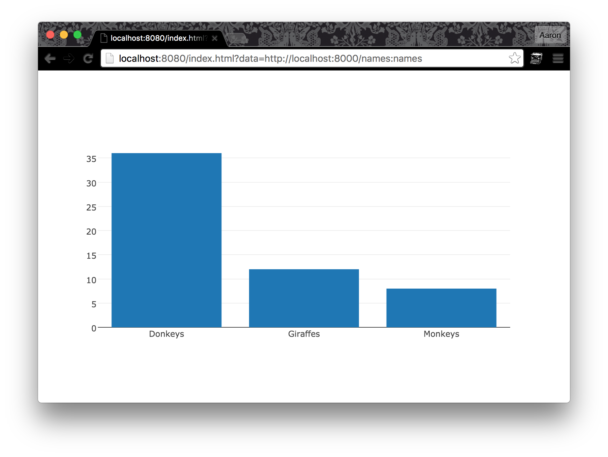

# Plotly Bar Chart

This renders noms data as a bar chart using Plotly (https://plot.ly/javascript/).



## Build

```
npm install
npm run build
```

## Run

```
noms-view serve .
```

Then, navigate to the URL printed by noms-view, e.g. http://127.0.0.1:12345?store=xyz.

## Develop

```
npm run start
noms-view serve .
```

## TODO

- Build some sort of sample pipeline to feed this real data
