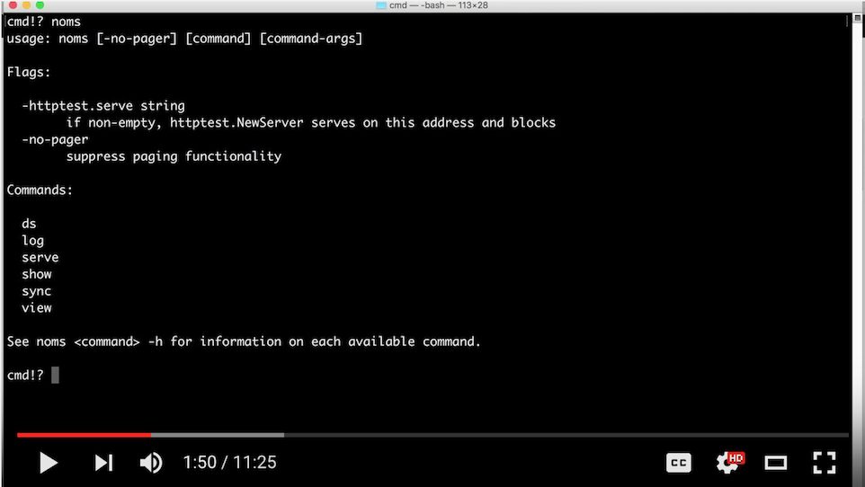

# A Short Tour of the Noms CLI

This is a quick introduction to the Noms command-line interface. It should only take a few minutes to read, but there's also a screencast if you prefer:

[](https://www.youtube.com/watch?v=NeBsaNdAn68)

## Install Noms

... if you haven't already. Follow the instructions [here](https://github.com/attic-labs/noms#setup).

## The `noms` command

Now you should be able to run `noms`:

```
> noms
Noms is a tool for goofing with Noms data.

Usage:

  noms command [arguments]

The commands are:

  diff        Shows the difference between two objects
  ds          Noms dataset management
  log         Displays the history of a Noms dataset
  serve       Serves a Noms database over HTTP
  show        Shows a serialization of a Noms object
  sync        Moves datasets between or within databases
  version     Display noms version

Use "noms help [command]" for more information about a command.
```

Without any arguments, `noms` lists out all available commands. To get information on a specific command, we can use `noms help [command]`:

```
> noms help sync
usage: noms sync [options] <source-object> <dest-dataset>

See Spelling Objects at https://github.com/attic-labs/noms/blob/master/doc/spelling.md for details on the object and dataset arguments.

...
```

## noms ds

There's a sample database running at http://demo.noms.io/cli-tour. Let's take a look inside...

The `noms ds` command lists the _datasets_ within a particular database:

```
> noms ds http://demo.noms.io/cli-tour
...
sf-film-locations/raw
sf-film-locations
...
```

## noms log

Noms datasets are versioned. You can see the history with `log`:

```
> noms log http://demo.noms.io/cli-tour::sf-film-locations

commit q4jcc2i7kntkjiipvjgpr5r02ldroj0g
Parent:    pckdvpvr9br1fie6c3pjudrlthe7na18
Date:      "2016-07-25T18:51:23+0000"
InputPath: "http://demo.noms.io/cli-tour::sf-film-locations/raw.value"

commit pckdvpvr9br1fie6c3pjudrlthe7na18
Parent:    c506ta03786j48a07he83ju669u78qa2
Date:      "2016-07-25T18:34:00+0000"
InputPath: "http://localhost:8000/cli-tour::sf-film-locations/raw.value"
[213] {
-   Locations: "Mission Delores Park (Mission District) via J-Church MUNI Train"
+   Locations: "Mission Dolores Park (Mission District) via J-Church MUNI Train"
  }
[221] {
-   FunFacts: "Mission Delores' official name is Mission San Francisco de Assis. It is the oldest bu
...

commit c506ta03786j48a07he83ju669u78qa2
Parent:    dl0j63uouu3e64tqrcnqokmisgkdoarb
Date:      "2016-07-25T18:34:00+0000"
InputPath: "http://localhost:8000/cli-tour::sf-film-locations/raw.value"
[6] {
-   Locations: "Randall Musuem"
+   Locations: "Randall Museum"
  }
(root) {
+   Row {
+     Actor1: "Charles Chaplin",
...
```

Note that Noms is a typed system. What is being shown here for each entry is not text, but a serialization of the diff between two datasets.

## noms show

You can see the entire serialization of any object in the database with `noms show`:

```
> noms show 'http://demo.noms.io/cli-tour::#pckdvpvr9br1fie6c3pjudrlthe7na18'

struct Commit {
  meta: struct {},
  parents: Set<Ref<Cycle<Commit>>>,
  value: List<struct Row {
    Actor1: String,
    Actor2: String,
    Actor3: String,
    Director: String,
    Distributor: String,
    FunFacts: String,
    Locations: String,
    ProductionCompany: String,
    ReleaseYear: Number,
    Title: String,
    Writer: String,
  }>,
}({
  meta: Meta {
    date: "2016-07-25T18:34:00+0000",
    inputPath: "http://localhost:8000/cli-tour::sf-film-locations/raw.value",
  },
  parents: {
    c506ta03786j48a07he83ju669u78qa2,
  },
  value: [  // 1,241 items
    Row {
      Actor1: "Siddarth",
...
```

## noms sync

You can work with Noms databases that are remote exactly the same as you work with local databases. But it's frequently useful to move data to a local machine, for example, to make a private fork or to work with the data disconnected from the source database.

Moving data in Noms is done with the `sync` command. Note that unlike Git, we do not make a distinction between _push_ and _pull_. It's the same operation in both directions:

```
> noms sync http://demo.noms.io/cli-tour::sf-film-locations /tmp/noms::films
> noms ds /tmp/noms
films
```

We can now make an edit locally:

```
> go install github.com/attic-labs/noms/samples/go/csv/...
> csv-export /tmp/noms::films > /tmp/film-locations.csv
```

open /tmp/film-location.csv and edit it, then:

```
> csv-import --column-types=String,String,String,String,String,String,String,String,Number,String,String \
    /tmp/film-locations.csv /tmp/noms::films
```

#noms diff

The `noms diff` command can show you the differences between any two values. Let's see our change:

```
> noms diff http://demo.noms.io/cli-tour::sf-film-locations /tmp/noms::films

./.meta {
-   "date": "2016-07-25T18:51:23+0000"
+   "date": "2016-07-25T22:51:14+0000"
+   "inputFile": "/tmp/film-locations.csv"
-   "inputPath": "http://demo.noms.io/cli-tour::sf-film-locations/raw.value"
./.parents {
-   pckdvpvr9br1fie6c3pjudrlthe7na18
+   q4jcc2i7kntkjiipvjgpr5r02ldroj0g
  }
./.value[0] {
-   "Locations": "Epic Roasthouse (399 Embarcadero)"
+   "Locations": "Epic Roadhouse (399 Embarcadero)"
```

