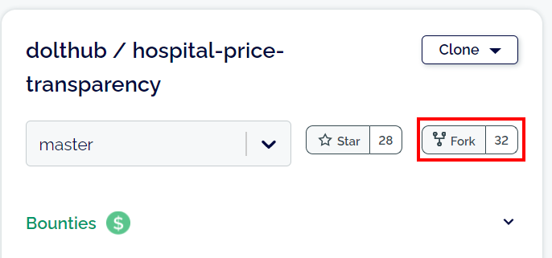
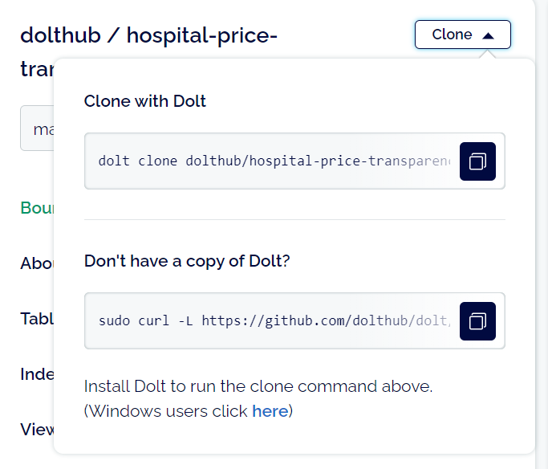
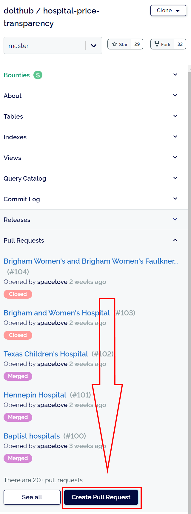
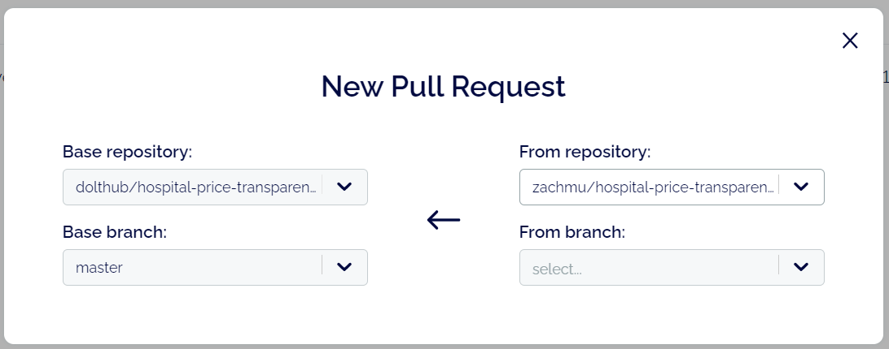

# Dolt quickstart guide

This is a one-page guide to getting you started with Dolt as quickly
as possible. If you're trying to participate in a
[data bounty](https://www.dolthub.com/bounties), this will get you
up and running. We think bounties are the most engaging way to get
started using Dolt and DoltHub and understand how it all works.

This guide is intended for new data bounty participants, and is geared
to that use case. You can find more complete documentation on how to
use Dolt in the [README](../README.md) and in the [DoltHub
documentation](https://docs.dolthub.com/introduction/installation).

## Install Dolt

```sh
% sudo bash -c 'curl -L https://github.com/dolthub/dolt/releases/latest/download/install.sh | bash'
```

For windows installation, see [here](windows.md).

## Configure dolt

```sh
% dolt config --global --add user.email YOU@DOMAIN.COM
% dolt config --global --add user.name "YOUR NAME"
```

## Fork the data bounty

Forking a database makes a private copy for you to edit. Find the
database you want to edit, then click the "Fork" button on the top
left.



## Clone your fork

Cloning your fork of the database downloads it to your local computer
so you can make changes to it. Click
"Clone" to find the command to copy and paste into your terminal. This
clone command will be different for every fork, so you can't just copy
and paste the command in the text below.



Run the command, then cd into the database directory.

```sh
% dolt clone dolthub/hospital-price-transparency
% cd hospital-price-transparency
```

## Inspect the data

Get familiar with the tables and their columns. The easiest way to do
this is by using SQL commands. `show tables` and `describe <tablename>` are good commands to use when exploring a new database.

```sql
% dolt sql
# Welcome to the DoltSQL shell.
# Statements must be terminated with ';'.
# "exit" or "quit" (or Ctrl-D) to exit.
hospital_price_transparency> show tables;
+-----------+
| Table     |
+-----------+
| cpt_hcpcs |
| hospitals |
| prices    |
+-----------+
hospital_price_transparency> describe hospitals;
+----------------+--------------+------+-----+---------+-------+
| Field          | Type         | Null | Key | Default | Extra |
+----------------+--------------+------+-----+---------+-------+
| npi_number     | char(16)     | NO   | PRI |         |       |
| name           | varchar(256) | YES  |     |         |       |
| url            | varchar(512) | YES  |     |         |       |
| street_address | varchar(512) | YES  |     |         |       |
| city           | varchar(64)  | YES  |     |         |       |
| state          | varchar(32)  | YES  |     |         |       |
| zip_code       | varchar(16)  | YES  |     |         |       |
| publish_date   | date         | YES  |     |         |       |
+----------------+--------------+------+-----+---------+-------+
hospital_price_transparency> select npi_number, name, street_address from hospitals limit 3;
+------------+------------------------------------+---------------------+
| npi_number | name                               | street_address      |
+------------+------------------------------------+---------------------+
| 1003873225 | The Specialty Hospital Of Meridian | 1314 19th Ave       |
| 1023061405 | Grandview Medical Center           | 3690 Grandview Pkwy |
| 1023180502 | Medical City Dallas                | 7777 Forest Ln      |
+------------+------------------------------------+---------------------+
hospital_price_transparency> exit
Bye
```

## Add some data

There are two main ways to add data into your copy of the
database. You can either import from files, or you can add data by
writing scripts and inserting rows with SQL statements.

### Importing files

Use the `dolt table import` command to import CSV or JSON files. Use
the `-u` option to update the table (instead of replacing the
contents).

```sh
% dolt table import -u prices hospital_prices.csv
```

### Starting a SQL server

If you want to write a script to insert data with python or another
programming language, start a SQL server on the command line:

```sh
% dolt sql-server
Starting server with Config HP="localhost:3306"|U="root"|P=""|T="28800000"|R="false"|L="info"
```

Then connect to the database with any standard MySQL connector and
make your edits.

## See your changes

After you've inserted some data, you can inspect the changes you made
using `dolt diff`. If you added a lot of rows, use the `--summary` flag
to get a summary instead.

```sh
% dolt diff
% dolt diff --summary
```

## Commit your changes

These commands work like `git`, if you know `git`. If you don't know
`git`, don't worry! Most people who know `git` don't actually know
`git` either!

```sh
% dolt add .
% dolt commit -m "This message describes my changes"
```

You can repeat these steps as many times as you have more changes to add:

1. Add data
2. Commit your changes

Every time you commit it creates a checkpoint you can roll back to if
you mess up later.

## Push your changes back to DoltHub and create a PR

When you're done adding data, push the database back to DoltHub and
submit a pull request (PR) to merge them back into the original fork.

```sh
% dolt push origin master
```





## Respond to PR review feedback

Your PR will be reviewed by the people running the bounty, and they
may ask you to make changes. If they do, then go ahead and make your
changes on your machine, then `dolt push` those new commits back to
DoltHub and your existing PR will automatically be updated with them.

## Questions? Still need help?

Come hang out with us on [our
Discord](https://discord.com/invite/RFwfYpu), where the team that
builds Dolt and lots of other customers are available to chat and ask
questions. If this guide is missing something obvious, come tell us
there!
