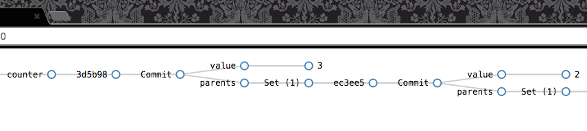

# Splore

Splore is a general-purpose debug UI for exploring noms data.



## Example

```sh
# Create some data
cd "$GOPATH/src/github.com/attic-labs/noms/samples/go/counter"
go build
./counter /tmp/sploretest::counter
./counter /tmp/sploretest::counter

# Build Splore
cd ../../js/splore
./build.py

# Serve Splore
./node_modules/.bin/http-server &
open http://localhost:8080
```

## Develop

Same as the example, but:
* `./build.py` is only necessary the first time.
* Run `npm run start` to continuously build a non-minified (and thus debuggable) build.
